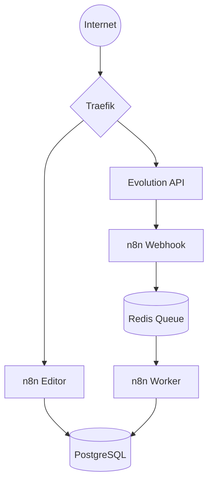

# Arquitetura e Infraestrutura — evolutionAK

Este documento detalha a estrutura técnica, o fluxo de dados e os protocolos de segurança do projeto **evolutionAK**, hospedado em uma VPS DigitalOcean e gerenciado via **Easypanel**.

---

## 1. Visão Geral da Infraestrutura
A infraestrutura utiliza **Docker** e **Easypanel**, com o **Traefik** atuando como proxy reverso para gerenciar o tráfego e certificados SSL automaticamente.

## Stack Tecnológica

- Docker
- Easypanel
- Traefik
- PostgreSQL
- Redis
- n8n
- Evolution API
- VPS DigitalOcean

### Serviços Ativos:
* **evolution-api:** Responsável por WhatsApp, Webhooks e integrações.
* **n8n (Arquitetura de Filas):**
    * `n8n_editor`: Interface para criação de workflows (Porta 5678).
    * `n8n_webhook`: Instância dedicada a receber gatilhos externos.
    * `n8n_worker`: Instância para execução assíncrona de workflows.
      A arquitetura utiliza o modo Queue do n8n para desacoplar:
- interface
- entrada de webhooks
- processamento
* **postgres:** Banco de dados principal (Porta 5432).
* **redis:** Gerenciamento de Fila Bull e cache (Porta 6379).

---

## 2. Fluxo de Rede e Conectividade
A comunicação externa é mediada pelo Traefik, garantindo que os containers internos nunca fiquem expostos diretamente à internet.

### Fluxo de Requisição:
`Internet` → `Traefik (HTTPS 443)` → `Container Docker` → `Aplicação`

### Endpoints Atuais:
* **Editor n8n:** `evolution-ak-editor.hvyck8.easypanel.host`
* **Webhooks n8n:** `https://evolution-ak-webhook.hvyck8.easypanel.host`
* **Evolution API:** `https://evolution-ak-evolution.hvyck8.easypanel.host`

---

## 3. Lógica de Processamento de Dados
O fluxo de uma automação típica segue a hierarquia de microsserviços para garantir escalabilidade:

1.  **Entrada:** Mensagem recebida via WhatsApp.
2.  **Integração:** Evolution API processa o evento e dispara um Webhook.
3.  **Triagem:** O `n8n_webhook` recebe a requisição.
4.  **Fila:** O evento é enviado para a `Redis Queue` (Bull).
5.  **Execução:** O `n8n_worker` processa o workflow de forma assíncrona.
6.  **Persistência:** Dados finais são gravados no `Postgres`.

---

## 4. Segurança e SSL/TLS

### Certificados Automáticos
O Traefik gerencia automaticamente o **SSL/TLS** (HTTPS) para todos os subdomínios, garantindo criptografia em trânsito sem intervenção manual.

### Investigação de Segurança (Logs do Traefik)
Foi identificada uma tentativa externa de acesso ao arquivo `.env` (`GET /.env HTTP/1.1`).
* **Validação:** Foi executado um teste manual via terminal:
    ```bash
    curl -k https://localhost/.env
    ```
* **Resultado:** `404 Not Found`.
* **Conclusão:** As variáveis de ambiente estão protegidas e não são acessíveis via diretório público, pois são injetadas diretamente pelo Easypanel/Docker.

## 🚨 Disaster Recovery & Troubleshooting

Esta seção registra incidentes críticos, lições aprendidas e os procedimentos de recuperação para garantir a resiliência do ecossistema **EvolutionAK**.

### 1. Procedimento de "Hard Reset" (Destroy & Rebuild)
**Cenário:** Corrupção de estado nos containers (Redis/Traefik) ou falha persistente de sincronia na Evolution API (mensagens presas em "Aguardando mensagem").

* **Causa Raiz:** Persistência de sessões inválidas ou cache corrompido no Redis que impediam a descriptografia de ponta a ponta.
* **Ação:** Execução do protocolo "Destroy" para limpeza de volumes temporários.
* **Passos de Recuperação:**
    1.  **Interrupção:** Parar todos os serviços via Easypanel.
    2.  **Limpeza de Cache:** Deletar/Limpar volumes do Redis para eliminar "sessões fantasmas".
    3.  **Rebuild:** Forçar o rebuild das imagens para garantir o uso da última versão estável.
    4.  **Sincronização:** Re-autenticar instâncias do WhatsApp via QR Code na Evolution API.
* **Lição Aprendida:** Nem todo erro é de código ou lógica de workflow; falhas na camada de persistência de estado (Redis/Cache) exigem um reset completo da infraestrutura para restaurar a integridade.

### 2. Investigação de Segurança (Logs do Traefik)
**Cenário:** Identificada tentativa externa de acesso ao arquivo sensível `.env` através da requisição `GET /.env HTTP/1.1`.

* **Validação de Vulnerabilidade:** Foi executado um teste manual via terminal para verificar a exposição:
    ```bash
    curl -k [https://sua-url-aqui.com/.env](https://sua-url-aqui.com/.env)
    ```
* **Resultado:** `404 Not Found`.
* **Conclusão:** A arquitetura está segura. As variáveis de ambiente são injetadas diretamente pelo Docker/Easypanel no runtime do container e não residem em diretórios públicos ou estáticos acessíveis pelo servidor web/proxy.

---

## 5. Persistência de Dados
* **Volumes Docker:** Todos os dados do `Postgres` e do `Redis` são armazenados em volumes persistentes mapeados no host da VPS.
* **Segurança no Git:** Arquivos `.env` reais e chaves SSH estão bloqueados via `.gitignore`. O arquivo `.env.example` deve ser a única referência de variáveis no repositório.

---

## 6. Estado Atual da Infraestrutura

### Situação Atual
A infraestrutura encontra-se operacional em ambiente de produção inicial (self-hosted VPS), utilizando arquitetura baseada em containers Docker orquestrados pelo Easypanel.

### Características atuais
- Deploy manual via Easypanel
- SSL automático via Traefik
- Arquitetura assíncrona utilizando Redis Queue
- Banco PostgreSQL persistente
- Serviços segregados por responsabilidade
- Variáveis sensíveis protegidas fora do repositório Git

### Melhorias Futuras Planejadas
- domínio próprio
- backups automatizados do PostgreSQL
- CI/CD
- monitoramento centralizado
- firewall mais restritivo
- observabilidade e métricas
- escalabilidade horizontal dos workers

## Diagrama de Infraestrutura


