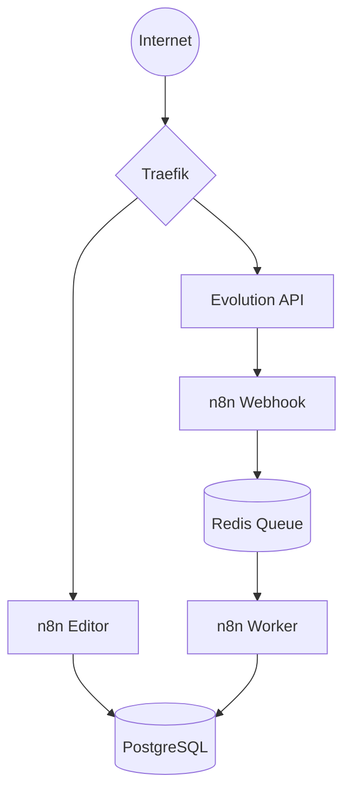

# Arquitetura e Infraestrutura — evolutionAK

Este documento detalha a estrutura técnica, o fluxo de dados e os protocolos de segurança do projeto **evolutionAK**, hospedado em uma VPS DigitalOcean e gerenciado via **Easypanel**.

---

## 1. Visão Geral da Infraestrutura
A infraestrutura utiliza **Docker** e **Easypanel**, com o **Traefik** atuando como proxy reverso para gerenciar o tráfego e certificados SSL automaticamente.

## Stack Tecnológica

- Docker
- Easypanel
- Traefik
- PostgreSQL
- Redis
- n8n
- Evolution API
- VPS DigitalOcean

### Serviços Ativos:
* **evolution-api:** Responsável por WhatsApp, Webhooks e integrações.
* **n8n (Arquitetura de Filas):**
    * `n8n_editor`: Interface para criação de workflows (Porta 5678).
    * `n8n_webhook`: Instância dedicada a receber gatilhos externos.
    * `n8n_worker`: Instância para execução assíncrona de workflows.
      A arquitetura utiliza o modo Queue do n8n para desacoplar:
- interface
- entrada de webhooks
- processamento
* **postgres:** Banco de dados principal (Porta 5432).
* **redis:** Gerenciamento de Fila Bull e cache (Porta 6379).

---

## 2. Fluxo de Rede e Conectividade
A comunicação externa é mediada pelo Traefik, garantindo que os containers internos nunca fiquem expostos diretamente à internet.

### Fluxo de Requisição:
`Internet` → `Traefik (HTTPS 443)` → `Container Docker` → `Aplicação`

### Endpoints Atuais:
* **Editor n8n:** `evolution-ak-editor.hvyck8.easypanel.host`
* **Webhooks n8n:** `https://evolution-ak-webhook.hvyck8.easypanel.host`
* **Evolution API:** `https://evolution-ak-evolution.hvyck8.easypanel.host`

---

## 3. Lógica de Processamento de Dados
O fluxo de uma automação típica segue a hierarquia de microsserviços para garantir escalabilidade:

1.  **Entrada:** Mensagem recebida via WhatsApp.
2.  **Integração:** Evolution API processa o evento e dispara um Webhook.
3.  **Triagem:** O `n8n_webhook` recebe a requisição.
4.  **Fila:** O evento é enviado para a `Redis Queue` (Bull).
5.  **Execução:** O `n8n_worker` processa o workflow de forma assíncrona.
6.  **Persistência:** Dados finais são gravados no `Postgres`.

---

## 4. Segurança e SSL/TLS

### Certificados Automáticos
O Traefik gerencia automaticamente o **SSL/TLS** (HTTPS) para todos os subdomínios, garantindo criptografia em trânsito sem intervenção manual.

---

## 5. Persistência de Dados
* **Volumes Docker:** Todos os dados do `Postgres` e do `Redis` são armazenados em volumes persistentes mapeados no host da VPS.
* **Segurança no Git:** Arquivos `.env` reais e chaves SSH estão bloqueados via `.gitignore`. O arquivo `.env.example` deve ser a única referência de variáveis no repositório.

---

## 6. Estado Atual da Infraestrutura

### Situação Atual
A infraestrutura encontra-se operacional em ambiente de produção inicial (self-hosted VPS), utilizando arquitetura baseada em containers Docker orquestrados pelo Easypanel.

### Características atuais
- Deploy manual via Easypanel
- SSL automático via Traefik
- Arquitetura assíncrona utilizando Redis Queue
- Banco PostgreSQL persistente
- Serviços segregados por responsabilidade
- Variáveis sensíveis protegidas fora do repositório Git

### Melhorias Futuras Planejadas
- domínio próprio
- backups automatizados do PostgreSQL
- CI/CD
- monitoramento centralizado
- firewall mais restritivo
- observabilidade e métricas
- escalabilidade horizontal dos workers

## Diagrama de Infraestrutura

## 🚨 Disaster Recovery & Troubleshooting

### 1. Procedimento de "Hard Reset" (Destroy da Droplet)
**Cenário:** Falha crítica de conectividade externa e SSL. A Evolution API estava inacessível e o Traefik não conseguia validar certificados para subdomínios essenciais (como o n8n).

* **Causa Raiz:** Conflito persistente nas configurações de rede/proxy na VPS que impediam a exposição correta dos serviços via HTTPS.
* **Ação:** Execução do "Destroy" completo da Droplet na DigitalOcean para uma reconstrução do zero.
* **Passos de Recuperação:**
    1.  Exclusão da Droplet antiga e criação de uma nova instância.
    2.  Reinstalação do Easypanel e re-deploy da stack.
    3.  Reconfiguração dos registros DNS e validação dos certificados SSL via Traefik.
* **Resultado:** Conectividade restabelecida e SSL validado em todos os serviços.

### 2. Incidente: Mensagens "Aguardando Mensagem" (Em Investigação)
**Cenário:** Após a reconstrução da infra, algumas mensagens automáticas chegam ao destinatário com o placeholder *"Aguardando mensagem. Essa ação pode levar alguns instantes"*.

* **Status Atual:** ⚠️ **Não corrigido.** * **Diagnóstico:** Problema de descriptografia de ponta a ponta. Ocorre geralmente quando a sessão do WhatsApp perde a sincronia com as chaves armazenadas na Evolution API após reconexões.
* **Tentativas de Resolução:**
    - O rebuild da infra reduziu a frequência, mas não eliminou o erro em mensagens enviadas imediatamente após o pareamento.
* **Próximos Passos:** Testar a deleção manual da instância dentro da Evolution API e pareamento via Type Pair (Código ou QR) com o celular ativo e conectado.

### 3. Investigação de Segurança (Logs do Traefik)
**Cenário:** Tentativa externa de acesso ao arquivo `.env` (`GET /.env`).
* **Validação:** Teste via `curl -k https://url.com/.env` retornou `404 Not Found`.
* **Conclusão:** Variáveis de ambiente protegidas; injetadas via Docker e não acessíveis via web.
